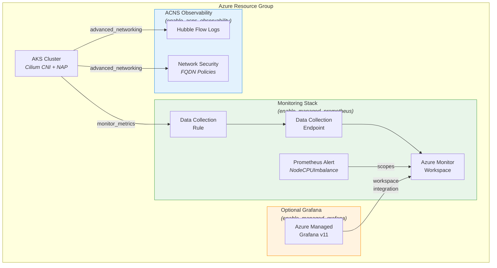
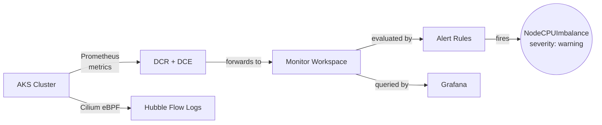
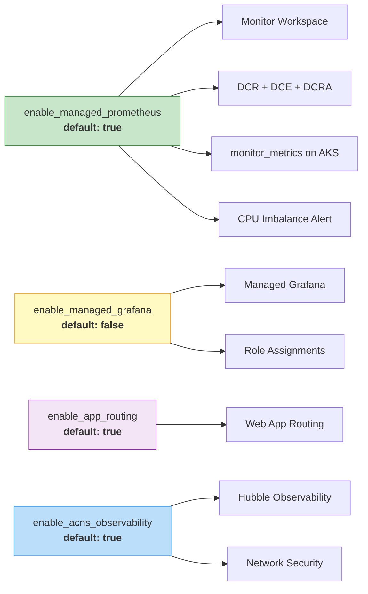
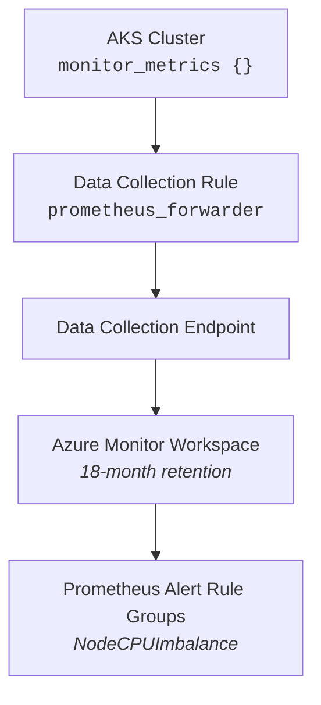
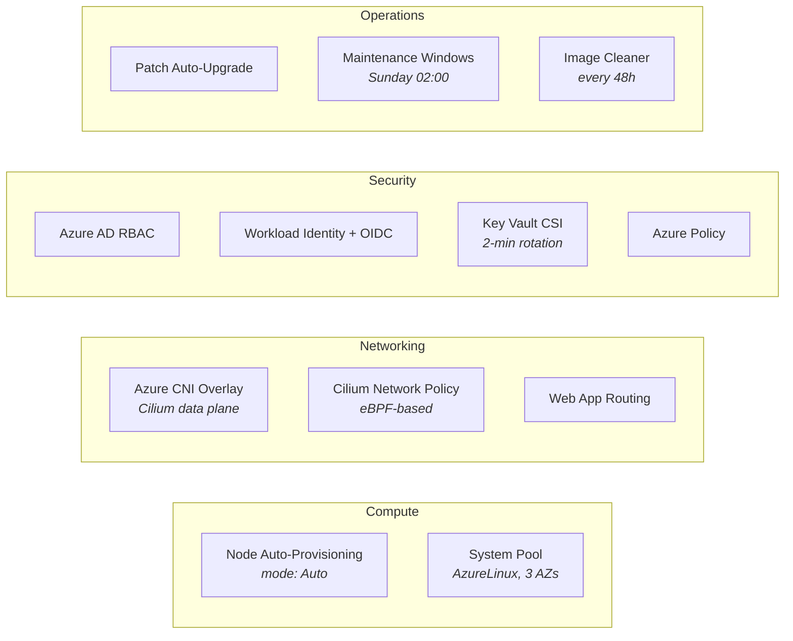

# AKS Node Auto-Provisioning (NAP) with Terraform

Deploy a production-grade Azure Kubernetes Service cluster with [Node Auto-Provisioning](https://learn.microsoft.com/azure/aks/node-autoprovision), **Azure Managed Prometheus**, and **Advanced Container Networking Services (ACNS)** observability — all via pure `azurerm` Terraform.

## Architecture



## Resource Flow



## Feature Toggles

All observability features are controlled by Terraform variables and can be independently enabled/disabled:



| Variable | Default | What it controls |
|----------|---------|-----------------|
| `enable_managed_prometheus` | `true` | Monitor Workspace, DCR/DCE pipeline, `monitor_metrics` block on AKS, Prometheus alert rules |
| `enable_managed_grafana` | `false` | Azure Managed Grafana instance + RBAC role assignments (requires Prometheus) |
| `enable_app_routing` | `true` | Web App Routing add-on (managed NGINX ingress controller) |
| `enable_acns_observability` | `true` | ACNS `advanced_networking` block: Hubble flow logs + network security (FQDN policies) |

## Prerequisites

- [Terraform](https://developer.hashicorp.com/terraform/install) >= 1.3
- [Azure CLI](https://learn.microsoft.com/cli/azure/install-azure-cli) >= 2.60
- AzureRM provider **4.62+** (pinned in `providers.tf`)
- An Azure subscription with permissions to create AKS clusters

## Project Structure

| File | Purpose |
|------|---------|
| `providers.tf` | Terraform & AzureRM provider configuration (v4.62.1) |
| `variables.tf` | Input variables — cluster config, feature toggles, networking |
| `main.tf` | AKS cluster with NAP, Cilium, ACNS, Prometheus addon |
| `monitoring.tf` | Monitor Workspace, DCR pipeline, Grafana, Prometheus alerts |
| `identity.tf` | Data source for current Azure client config |
| `outputs.tf` | Cluster endpoints, monitoring IDs, Grafana URL |
| `terraform.tfvars` | Environment-specific variable overrides |

## Getting Started

### 1. Authenticate

```bash
az login
export ARM_SUBSCRIPTION_ID=$(az account show --query id -o tsv)
```

### 2. Configure Variables

Edit `terraform.tfvars`:

```hcl
project_name              = "aks-nap"
resource_group_name       = "rg-aks-nap"
location                  = "swedencentral"
enable_managed_prometheus = true   # Monitor Workspace + alerts
enable_managed_grafana    = false  # Set true for Azure Managed Grafana
enable_app_routing        = true   # Web App Routing (managed NGINX)
enable_acns_observability = true   # Hubble + network security
```

### 3. Deploy

```bash
terraform init
terraform validate
terraform plan -out=tfplan
terraform apply tfplan
```

### 4. Connect to the Cluster

```bash
# Use the output command directly:
$(terraform output -raw get_credentials_command)

kubectl get nodes
```

## How It Was Built

### Design Decisions

1. **Pure `azurerm` provider** — no `azapi` or CLI workarounds. All resources use the stable [AzureRM v4.62](https://github.com/hashicorp/terraform-provider-azurerm/releases) API.

2. **Conditional resources via `count`** — every monitoring resource uses `count = var.enable_* ? 1 : 0` so features can be toggled without touching code.

3. **Dynamic blocks on AKS** — `monitor_metrics` and `advanced_networking` are `dynamic` blocks so the AKS resource itself adapts to feature flags.

### Managed Prometheus Pipeline

Enabling `enable_managed_prometheus` creates this data pipeline:



**Resources created:**

| Resource | Terraform Type | Purpose | Docs |
|----------|---------------|---------|------|
| Monitor Workspace | [`azurerm_monitor_workspace`](https://registry.terraform.io/providers/hashicorp/azurerm/latest/docs/resources/monitor_workspace) | Prometheus metrics store (18-month retention) | [Overview](https://learn.microsoft.com/azure/azure-monitor/metrics/prometheus-metrics-overview) |
| Data Collection Endpoint | [`azurerm_monitor_data_collection_endpoint`](https://registry.terraform.io/providers/hashicorp/azurerm/latest/docs/resources/monitor_data_collection_endpoint) | Metrics ingestion endpoint | [DCE docs](https://learn.microsoft.com/azure/azure-monitor/essentials/data-collection-endpoint-overview) |
| Data Collection Rule | [`azurerm_monitor_data_collection_rule`](https://registry.terraform.io/providers/hashicorp/azurerm/latest/docs/resources/monitor_data_collection_rule) | Forwards `Microsoft-PrometheusMetrics` stream | [DCR docs](https://learn.microsoft.com/azure/azure-monitor/essentials/data-collection-rule-overview) |
| DCR Association | [`azurerm_monitor_data_collection_rule_association`](https://registry.terraform.io/providers/hashicorp/azurerm/latest/docs/resources/monitor_data_collection_rule_association) | Links DCR → AKS cluster | [Association docs](https://learn.microsoft.com/azure/azure-monitor/essentials/data-collection-rule-overview#associations) |
| Alert Rule Group | [`azurerm_monitor_alert_prometheus_rule_group`](https://registry.terraform.io/providers/hashicorp/azurerm/latest/docs/resources/monitor_alert_prometheus_rule_group) | CPU imbalance detection | [Prometheus rules](https://learn.microsoft.com/azure/azure-monitor/metrics/prometheus-rule-groups) |

### CPU Imbalance Alert

The `NodeCPUImbalance` alert fires when any node's average CPU usage over 5 minutes exceeds the cluster-wide average by more than 20%:

```promql
(
  1 - avg by (instance) (rate(node_cpu_seconds_total{mode="idle"}[5m]))
)
>
(
  avg(1 - avg by (instance) (rate(node_cpu_seconds_total{mode="idle"}[5m]))) * 1.2
)
```

| Setting | Value |
|---------|-------|
| Evaluation interval | 1 minute (`PT1M`) |
| Must fire for | 5 minutes (`PT5M`) |
| Severity | 3 (warning) |

> **How it works:** The left side computes per-node CPU utilization (1 − idle rate). The right side computes the cluster-wide mean and multiplies by 1.2 (120%). If any single node exceeds the inflated average for 5 consecutive minutes, the alert fires. See [PromQL documentation](https://prometheus.io/docs/prometheus/latest/querying/basics/) for syntax reference.

### ACNS Observability (Hubble)

When `enable_acns_observability = true`, the AKS [`network_profile`](https://registry.terraform.io/providers/hashicorp/azurerm/latest/docs/resources/kubernetes_cluster#network_profile) includes:

```hcl
advanced_networking {
  observability_enabled = true   # Hubble flow logs, DNS metrics, drop tracking
  security_enabled      = true   # FQDN-based network policies
}
```

**Requires:** `network_data_plane = "cilium"` and `network_policy = "cilium"` (both already configured).

**What you get:**

| Capability | Description | Docs |
|-----------|-------------|------|
| Hubble Flow Logs | Pod-to-pod L3/L4 flow visibility via eBPF | [ACNS overview](https://learn.microsoft.com/azure/aks/advanced-container-networking-services-overview) |
| DNS Metrics | DNS resolution statistics and error tracking | [Enable ACNS](https://learn.microsoft.com/azure/aks/use-advanced-container-networking-services) |
| Drop Analysis | Dropped connection tracking and debugging | [Container Network Logs](https://learn.microsoft.com/azure/aks/how-to-configure-container-network-logs) |
| FQDN Filtering | Domain-based egress network policies | [FQDN filtering](https://learn.microsoft.com/azure/aks/fqdn-based-policy) |

> **Note:** Starting November 2025, Azure renamed `RetinaNetworkFlowLogs` to `ContainerNetworkLog`. See the [migration guide](https://learn.microsoft.com/azure/aks/how-to-configure-container-network-logs).

### Optional: Managed Grafana

Set `enable_managed_grafana = true` to deploy [Azure Managed Grafana](https://learn.microsoft.com/azure/managed-grafana/overview) (v11) with:
- Automatic [Monitor Workspace integration](https://learn.microsoft.com/azure/managed-grafana/how-to-connect-azure-monitor-workspace)
- `Monitoring Reader` and `Monitoring Data Reader` [role assignments](https://learn.microsoft.com/azure/role-based-access-control/built-in-roles#monitoring-reader)
- Pre-built dashboards for Prometheus metrics and [ACNS flow logs](https://grafana.com/grafana/dashboards/23155-azure-insights-containers-networking-flow-logs/)

## AKS Cluster Features

The cluster is configured with production-grade defaults:



| Feature | Configuration | Docs |
|---------|--------------|------|
| Node Auto-Provisioning | `mode = "Auto"` — AKS manages node scaling | [NAP docs](https://learn.microsoft.com/azure/aks/node-autoprovision) |
| CNI | Azure CNI Overlay with Cilium data plane | [Azure CNI Overlay](https://learn.microsoft.com/azure/aks/azure-cni-overlay) |
| Network Policy | Cilium (eBPF-based) | [Cilium on AKS](https://learn.microsoft.com/azure/aks/azure-cni-powered-by-cilium) |
| OS | AzureLinux across all node pools | [AzureLinux](https://learn.microsoft.com/azure/aks/use-azure-linux) |
| Upgrades | Patch auto-upgrade, weekly Sunday maintenance windows | [Auto-upgrade](https://learn.microsoft.com/azure/aks/auto-upgrade-cluster) |
| Security | Azure RBAC, Workload Identity, OIDC issuer, Azure Policy | [AKS security](https://learn.microsoft.com/azure/aks/concepts-security) |
| Storage | All CSI drivers enabled (blob, disk, file, snapshots) | [CSI drivers](https://learn.microsoft.com/azure/aks/csi-storage-drivers) |
| Secrets | Key Vault CSI with 2-minute rotation | [Key Vault CSI](https://learn.microsoft.com/azure/aks/csi-secrets-store-driver) |
| Image Hygiene | Image cleaner every 48 hours | [Image Cleaner](https://learn.microsoft.com/azure/aks/image-cleaner) |
| Web App Routing | Managed NGINX ingress controller | [Web App Routing](https://learn.microsoft.com/azure/aks/app-routing) |
| Workload Identity | OIDC federation for pod-level Azure auth | [Workload Identity](https://learn.microsoft.com/azure/aks/workload-identity-overview) |
| Cost Analysis | Namespace/deployment cost breakdown in Azure Portal | [Cost Analysis](https://learn.microsoft.com/azure/aks/cost-analysis) |

## Input Variables

| Variable | Type | Default | Description |
|----------|------|---------|-------------|
| `location` | `string` | `"WestEurope"` | Azure region for all resources |
| `resource_group_name` | `string` | — (required) | Name of the resource group |
| `project_name` | `string` | `"aks-nap"` | Prefix for all resource names |
| `environment` | `string` | `"production"` | Environment tag |
| `kubernetes_version` | `string` | `"1.33"` | Kubernetes minor version alias |
| `aks_admin_group_ids` | `list(string)` | `[]` | Azure AD group IDs for cluster admin role |
| `system_node_vm_size` | `string` | `"Standard_D4ds_v5"` | VM size for system node pool |
| `system_node_count` | `number` | `2` | System node pool count |
| `private_cluster_enabled` | `bool` | `false` | Enable private API server |
| `private_cluster_public_fqdn_enabled` | `bool` | `false` | Enable public FQDN for private cluster |
| `api_server_vnet_integration_enabled` | `bool` | `false` | Enable API server VNet integration |
| `api_server_subnet_id` | `string` | `null` | Subnet ID for VNet integration |
| `enable_managed_prometheus` | `bool` | `true` | Enable full Prometheus monitoring stack |
| `enable_managed_grafana` | `bool` | `false` | Enable Azure Managed Grafana |
| `enable_app_routing` | `bool` | `true` | Enable Web App Routing add-on (managed NGINX) |
| `enable_acns_observability` | `bool` | `true` | Enable ACNS Hubble + network security |

## Outputs

| Output | Description |
|--------|-------------|
| `cluster_name` | AKS cluster name |
| `cluster_fqdn` | Cluster API server FQDN |
| `get_credentials_command` | Ready-to-run `az aks get-credentials` command |
| `monitor_workspace_id` | Prometheus Monitor Workspace ID (null if disabled) |
| `grafana_endpoint` | Grafana URL (null if disabled) |
| `prometheus_rule_group_id` | CPU imbalance alert rule group ID (null if disabled) |
| `acns_observability_enabled` | Whether ACNS/Hubble is active |
| `portal_url` | Direct link to AKS in Azure Portal |

## Tear Down

```bash
terraform destroy
```

## References

### Terraform Resources
- [`azurerm_kubernetes_cluster`](https://registry.terraform.io/providers/hashicorp/azurerm/latest/docs/resources/kubernetes_cluster) — AKS cluster with all addons
- [`azurerm_monitor_workspace`](https://registry.terraform.io/providers/hashicorp/azurerm/latest/docs/resources/monitor_workspace) — Azure Monitor Workspace for Prometheus
- [`azurerm_monitor_data_collection_rule`](https://registry.terraform.io/providers/hashicorp/azurerm/latest/docs/resources/monitor_data_collection_rule) — DCR for metrics pipeline
- [`azurerm_monitor_alert_prometheus_rule_group`](https://registry.terraform.io/providers/hashicorp/azurerm/latest/docs/resources/monitor_alert_prometheus_rule_group) — Prometheus alert rules
- [`azurerm_dashboard_grafana`](https://registry.terraform.io/providers/hashicorp/azurerm/latest/docs/resources/dashboard_grafana) — Azure Managed Grafana

### Azure Documentation
- [Azure Managed Prometheus Overview](https://learn.microsoft.com/azure/azure-monitor/metrics/prometheus-metrics-overview)
- [Enable Monitoring for AKS](https://learn.microsoft.com/azure/azure-monitor/containers/kubernetes-monitoring-enable)
- [Prometheus Rule Groups](https://learn.microsoft.com/azure/azure-monitor/metrics/prometheus-rule-groups)
- [ACNS Overview](https://learn.microsoft.com/azure/aks/advanced-container-networking-services-overview)
- [Enable ACNS on AKS](https://learn.microsoft.com/azure/aks/use-advanced-container-networking-services)
- [Container Network Logs (Hubble)](https://learn.microsoft.com/azure/aks/how-to-configure-container-network-logs)
- [Azure CNI Powered by Cilium](https://learn.microsoft.com/azure/aks/azure-cni-powered-by-cilium)
- [Node Auto-Provisioning](https://learn.microsoft.com/azure/aks/node-autoprovision)
- [AKS Workload Identity](https://learn.microsoft.com/azure/aks/workload-identity-overview)
- [Azure Managed Grafana](https://learn.microsoft.com/azure/managed-grafana/overview)

### Community
- [ACNS Lab Walkthrough](https://azure-samples.github.io/aks-labs/docs/networking/acns-lab/)
- [Grafana Dashboard: ACNS Flow Logs](https://grafana.com/grafana/dashboards/23155-azure-insights-containers-networking-flow-logs/)
- [PromQL Cheat Sheet](https://promlabs.com/promql-cheat-sheet/)

## Useful Commands

| Command | Description |
|---------|-------------|
| `terraform plan` | Dry-run — shows what will change |
| `terraform apply` | Create / update infrastructure |
| `terraform destroy` | Delete all managed resources |
| `terraform output` | Display output values |
| `terraform state list` | List resources in state |

## Using GitHub Copilot

This repo includes a [`.github/copilot-instructions.md`](.github/copilot-instructions.md) file that gives GitHub Copilot context about the project's conventions, architecture, and patterns. This means Copilot (in VS Code, CLI, or GitHub.com) automatically understands the codebase when you ask questions or request changes.

### What you can ask Copilot

| Task | Example prompt |
|------|---------------|
| Add a new feature toggle | *"Add a variable to enable/disable KEDA on the cluster"* |
| Understand the architecture | *"How does the Prometheus monitoring pipeline work?"* |
| Modify cluster settings | *"Change the maintenance window to Saturday 03:00"* |
| Add monitoring resources | *"Add a Prometheus alert for pod restart rate"* |
| Review configuration | *"Are there any security best practices missing?"* |
| Extend outputs | *"Add an output for the kubelet identity client ID"* |

### Tips

- **Copilot CLI** (`gh copilot`): Ask questions directly in your terminal — e.g., `gh copilot explain "what does node_provisioning_profile do?"`
- **Copilot in VS Code**: Open any `.tf` file and use inline chat (`Ctrl+I` / `Cmd+I`) for targeted edits
- **Copilot on GitHub.com**: Use Copilot in pull request reviews to validate Terraform changes
- The copilot instructions file ensures consistent conventions (naming, tagging, feature toggle patterns) across all AI-assisted edits

### Learn More

| Resource | Link |
|----------|------|
| GitHub Copilot Docs | [docs.github.com/en/copilot](https://docs.github.com/en/copilot) |
| Copilot CLI Docs | [docs.github.com/en/copilot/how-tos/copilot-cli](https://docs.github.com/en/copilot/how-tos/copilot-cli) |
| Custom Instructions Guide | [docs.github.com/en/copilot/how-tos/configure-custom-instructions](https://docs.github.com/en/copilot/how-tos/configure-custom-instructions) |
| Copilot Fundamentals (free course) | [learn.microsoft.com/en-us/training/paths/copilot](https://learn.microsoft.com/en-us/training/paths/copilot/) |
| Copilot CLI Blog Post | [github.blog — Agentic workflows in your terminal](https://github.blog/ai-and-ml/github-copilot/power-agentic-workflows-in-your-terminal-with-github-copilot-cli/) |
| Agent Skills in VS Code | [code.visualstudio.com/docs/copilot/customization/agent-skills](https://code.visualstudio.com/docs/copilot/customization/agent-skills) |