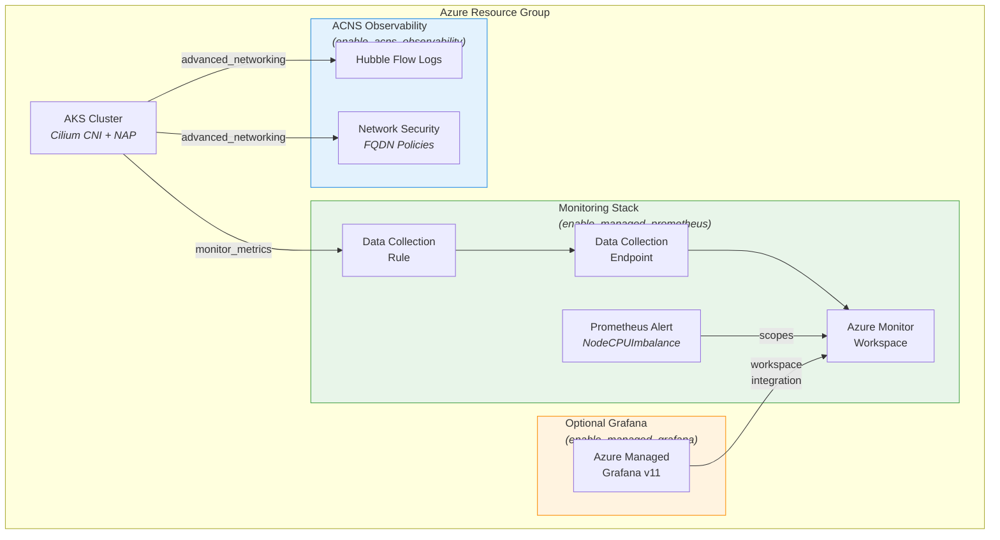
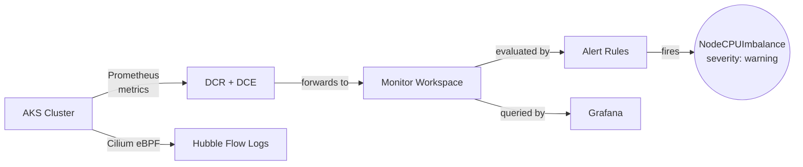
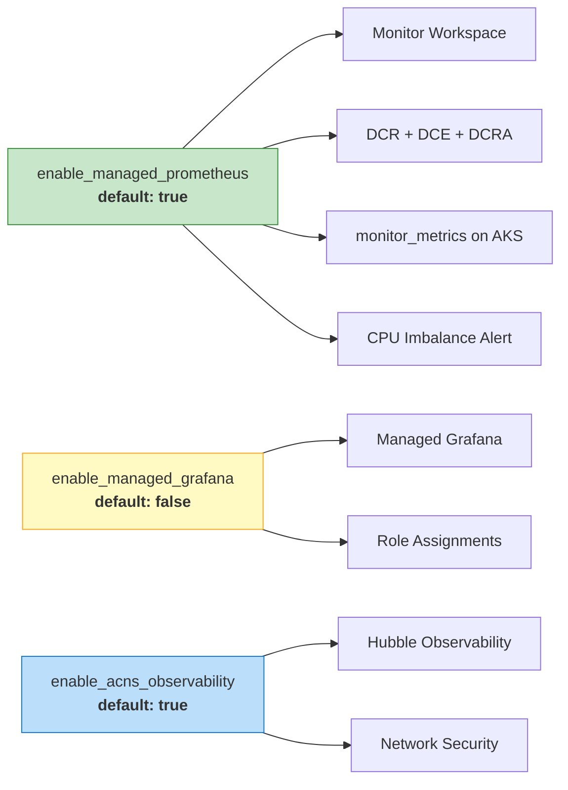

# AKS Node Auto-Provisioning (NAP) with Terraform

Deploy a production-grade Azure Kubernetes Service cluster with [Node Auto-Provisioning](https://learn.microsoft.com/azure/aks/node-autoprovision), **Azure Managed Prometheus**, and **Advanced Container Networking Services (ACNS)** observability — all via pure `azurerm` Terraform.

## Architecture



## Resource Flow



## Feature Toggles

All observability features are controlled by Terraform variables and can be independently enabled/disabled:



| Variable | Default | What it controls |
|----------|---------|-----------------|
| `enable_managed_prometheus` | `true` | Monitor Workspace, DCR/DCE pipeline, `monitor_metrics` block on AKS, Prometheus alert rules |
| `enable_managed_grafana` | `false` | Azure Managed Grafana instance + RBAC role assignments (requires Prometheus) |
| `enable_acns_observability` | `true` | ACNS `advanced_networking` block: Hubble flow logs + network security (FQDN policies) |

## Prerequisites

- [Terraform](https://developer.hashicorp.com/terraform/install) >= 1.3
- [Azure CLI](https://learn.microsoft.com/cli/azure/install-azure-cli) >= 2.60
- AzureRM provider **4.62+** (pinned in `providers.tf`)
- An Azure subscription with permissions to create AKS clusters

## Project Structure

| File | Purpose |
|------|---------|
| `providers.tf` | Terraform & AzureRM provider configuration (v4.62.1) |
| `variables.tf` | Input variables — cluster config, feature toggles, networking |
| `main.tf` | AKS cluster with NAP, Cilium, ACNS, Prometheus addon |
| `monitoring.tf` | Monitor Workspace, DCR pipeline, Grafana, Prometheus alerts |
| `identity.tf` | Data source for current Azure client config |
| `outputs.tf` | Cluster endpoints, monitoring IDs, Grafana URL |
| `terraform.tfvars` | Environment-specific variable overrides |

## Getting Started

### 1. Authenticate

```bash
az login
export ARM_SUBSCRIPTION_ID=$(az account show --query id -o tsv)
```

### 2. Configure Variables

Edit `terraform.tfvars`:

```hcl
project_name              = "aks-nap"
resource_group_name       = "rg-aks-nap"
location                  = "swedencentral"
enable_managed_prometheus = true   # Monitor Workspace + alerts
enable_managed_grafana    = false  # Set true for Azure Managed Grafana
enable_acns_observability = true   # Hubble + network security
```

### 3. Deploy

```bash
terraform init
terraform validate
terraform plan -out=tfplan
terraform apply tfplan
```

### 4. Connect to the Cluster

```bash
# Use the output command directly:
$(terraform output -raw get_credentials_command)

kubectl get nodes
```

## How It Was Built

### Design Decisions

1. **Pure `azurerm` provider** — no `azapi` or CLI workarounds. All resources use the stable AzureRM v4.62 API.

2. **Conditional resources via `count`** — every monitoring resource uses `count = var.enable_* ? 1 : 0` so features can be toggled without touching code.

3. **Dynamic blocks on AKS** — `monitor_metrics` and `advanced_networking` are `dynamic` blocks so the AKS resource itself adapts to feature flags.

### Managed Prometheus Pipeline

Enabling `enable_managed_prometheus` creates this data pipeline:

```
AKS (monitor_metrics addon)
  → Data Collection Rule (prometheus_forwarder)
    → Data Collection Endpoint
      → Azure Monitor Workspace
        → Prometheus Alert Rule Groups
```

**Resources created:**

| Resource | Type | Purpose |
|----------|------|---------|
| `azurerm_monitor_workspace` | Storage | Prometheus metrics store (18-month retention) |
| `azurerm_monitor_data_collection_endpoint` | Ingestion | Metrics ingestion endpoint |
| `azurerm_monitor_data_collection_rule` | Pipeline | Forwards `Microsoft-PrometheusMetrics` stream |
| `azurerm_monitor_data_collection_rule_association` | Binding | Links DCR → AKS cluster |
| `azurerm_monitor_alert_prometheus_rule_group` | Alerting | CPU imbalance detection |

### CPU Imbalance Alert

The `NodeCPUImbalance` alert fires when any node's average CPU usage over 5 minutes exceeds the cluster-wide average by more than 20%:

```promql
(
  1 - avg by (instance) (rate(node_cpu_seconds_total{mode="idle"}[5m]))
)
>
(
  avg(1 - avg by (instance) (rate(node_cpu_seconds_total{mode="idle"}[5m]))) * 1.2
)
```

| Setting | Value |
|---------|-------|
| Evaluation interval | 1 minute (`PT1M`) |
| Must fire for | 5 minutes (`PT5M`) |
| Severity | 3 (warning) |

### ACNS Observability (Hubble)

When `enable_acns_observability = true`, the AKS `network_profile` includes:

```hcl
advanced_networking {
  observability_enabled = true   # Hubble flow logs, DNS metrics, drop tracking
  security_enabled      = true   # FQDN-based network policies
}
```

**Requires:** `network_data_plane = "cilium"` and `network_policy = "cilium"` (both already configured).

**What you get:**
- Pod-to-pod L3/L4 flow visibility via Hubble
- DNS resolution metrics and error tracking
- Dropped connection analysis
- FQDN-based egress filtering

### Optional: Managed Grafana

Set `enable_managed_grafana = true` to deploy Azure Managed Grafana (v11) with:
- Automatic Monitor Workspace integration
- `Monitoring Reader` and `Monitoring Data Reader` role assignments
- Pre-built dashboards for Prometheus metrics and ACNS flow logs

## AKS Cluster Features

The cluster is configured with production-grade defaults:

| Feature | Configuration |
|---------|--------------|
| Node Auto-Provisioning | `mode = "Auto"` — AKS manages node scaling |
| CNI | Azure CNI Overlay with Cilium data plane |
| Network Policy | Cilium (eBPF-based) |
| OS | AzureLinux across all node pools |
| Upgrades | Patch auto-upgrade, weekly Sunday maintenance windows |
| Security | Azure RBAC, Workload Identity, OIDC issuer, Azure Policy |
| Storage | All CSI drivers enabled (blob, disk, file, snapshots) |
| Secrets | Key Vault CSI with 2-minute rotation |
| Image Hygiene | Image cleaner every 48 hours |

## Outputs

| Output | Description |
|--------|-------------|
| `cluster_name` | AKS cluster name |
| `cluster_fqdn` | Cluster API server FQDN |
| `get_credentials_command` | Ready-to-run `az aks get-credentials` command |
| `monitor_workspace_id` | Prometheus Monitor Workspace ID (null if disabled) |
| `grafana_endpoint` | Grafana URL (null if disabled) |
| `prometheus_rule_group_id` | CPU imbalance alert rule group ID (null if disabled) |
| `acns_observability_enabled` | Whether ACNS/Hubble is active |
| `portal_url` | Direct link to AKS in Azure Portal |

## Tear Down

```bash
terraform destroy
```

## Useful Commands

| Command | Description |
|---------|-------------|
| `terraform plan` | Dry-run — shows what will change |
| `terraform apply` | Create / update infrastructure |
| `terraform destroy` | Delete all managed resources |
| `terraform output` | Display output values |
| `terraform state list` | List resources in state |